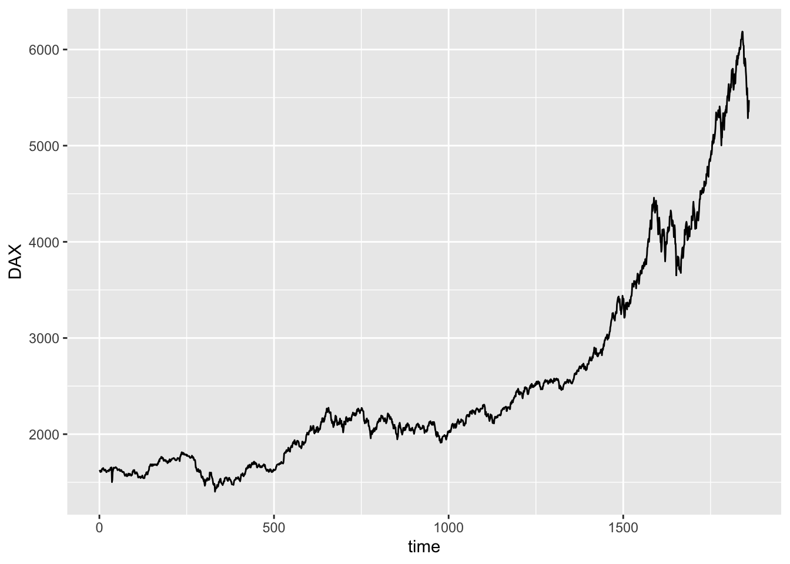
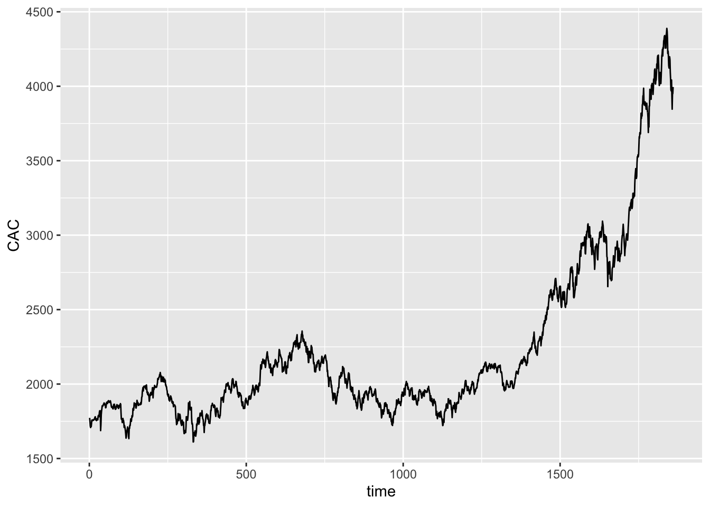
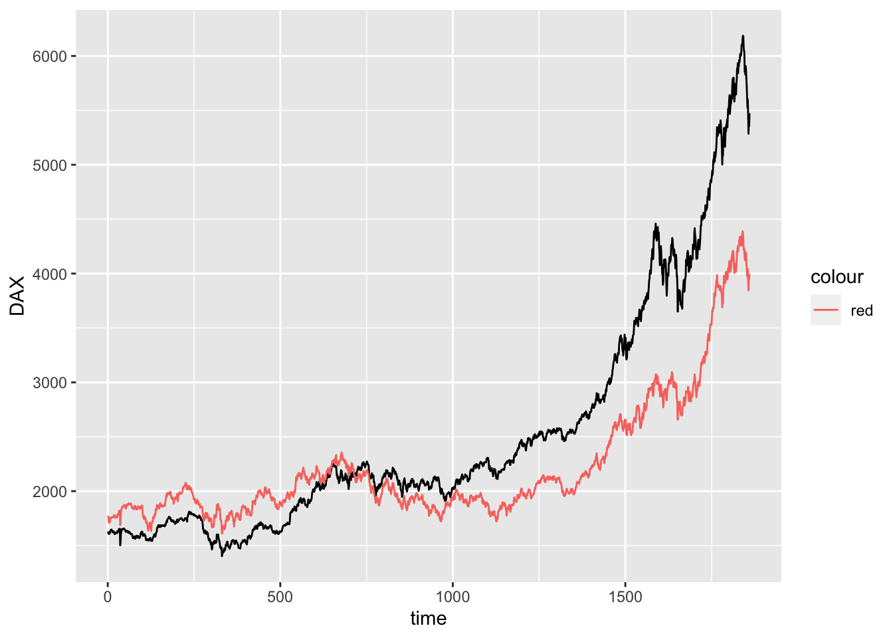
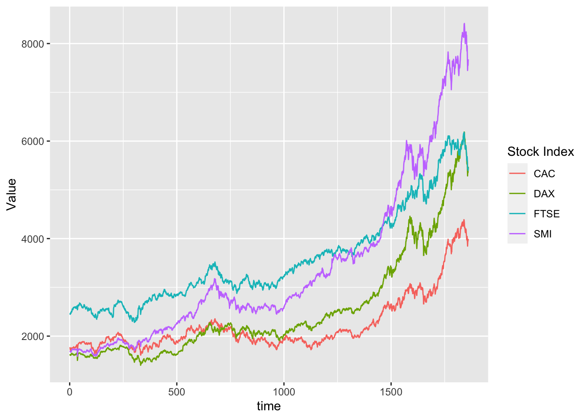

# tidyr and ggplot

::: {.cell}

```{.r .cell-code}
library(here)
```

::: {.cell-output .cell-output-stderr}
```
here() starts at /Users/nila/M1 S1/Data Management and Programming/git-r-101
```
:::

```{.r .cell-code}
library(ggplot2)
library(dplyr)
```

::: {.cell-output .cell-output-stderr}
```

Attaching package: 'dplyr'
```
:::

::: {.cell-output .cell-output-stderr}
```
The following objects are masked from 'package:stats':

    filter, lag
```
:::

::: {.cell-output .cell-output-stderr}
```
The following objects are masked from 'package:base':

    intersect, setdiff, setequal, union
```
:::

```{.r .cell-code}
library(tidyr)
here::i_am("git-r-101.Rproj")
```

::: {.cell-output .cell-output-stderr}
```
here() starts at /Users/nila/M1 S1/Data Management and Programming/git-r-101
```
:::
:::


## Multiple lines on a single graph

::: {.cell}

```{.r .cell-code}
eustock<-as.data.frame(EuStockMarkets)
eustock<-eustock |>mutate(time=1:n())
ggplot(eustock,aes(time,y=DAX))+
  geom_line()
```

::: {.cell-output-display}
{width=672}
:::
:::

::: {.cell}

```{.r .cell-code}
ggplot(eustock,aes(time,y=CAC))+
  geom_line()
```

::: {.cell-output-display}
{width=672}
:::
:::

### wrong solution

::: {.cell}

```{.r .cell-code}
ggplot(eustock,aes(time,y=DAX))+
  geom_line()+
  geom_line(mapping=aes(y=CAC,color="red"))
```

::: {.cell-output-display}
{width=672}
:::
:::

Problem:
-y axis name is wrong
- colors must be speicified manually
- we miss an association between colors and names 
### tidyr based solution

::: {.cell}

```{.r .cell-code}
long_eustock <-
  eustock|>pivot_longer(-time,names_to="Stock Index",values_to="Value")
```
:::

::: {.cell}

```{.r .cell-code}
ggplot(long_eustock,aes(x=time , y=Value ,group=`Stock Index`,color=`Stock Index`))+
  geom_line()
```

::: {.cell-output-display}
{width=672}
:::
:::

::: {.cell}

```{.r .cell-code}
ggplot(long_eustock,aes(x=time , y=Value ))+
  geom_line()+
  facet_wrap(~`Stock Index`,ncol=1 ,scales="free_y")
```

::: {.cell-output-display}
{width=672}
:::
:::
